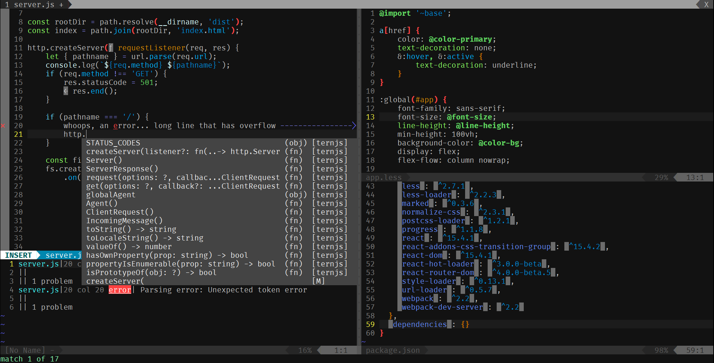

# .vim
My Vim configuration. Works with Vim, but some plugins require [Neovim]
(https://github.com/neovim/neovim).

### Usage
1. Clone the repository: `git clone https://github.com/aspyrx/.vim ~/.vim`
2. Symlink `~/.vimrc` to the `.vimrc` in this repository: `ln -s ~/.vim/.vimrc ~/.vimrc`
3. `cd ~/.vim`
4. Fetch the dependency plugins: `git submodule update --init --recursive`

### Screenshot

The font is [Fira Code](https://github.com/tonsky/FiraCode). Note that a font
that supports/is patched with the powerline symbols is recommended.

